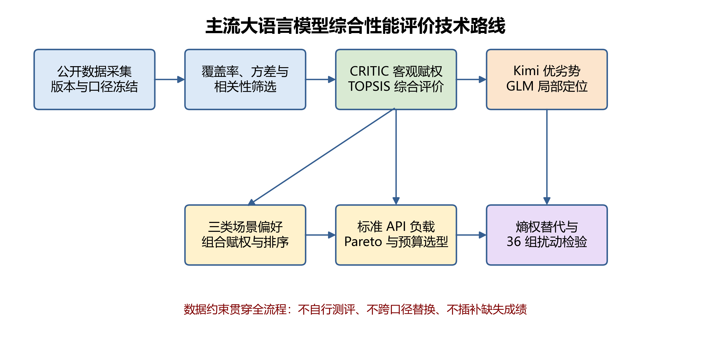
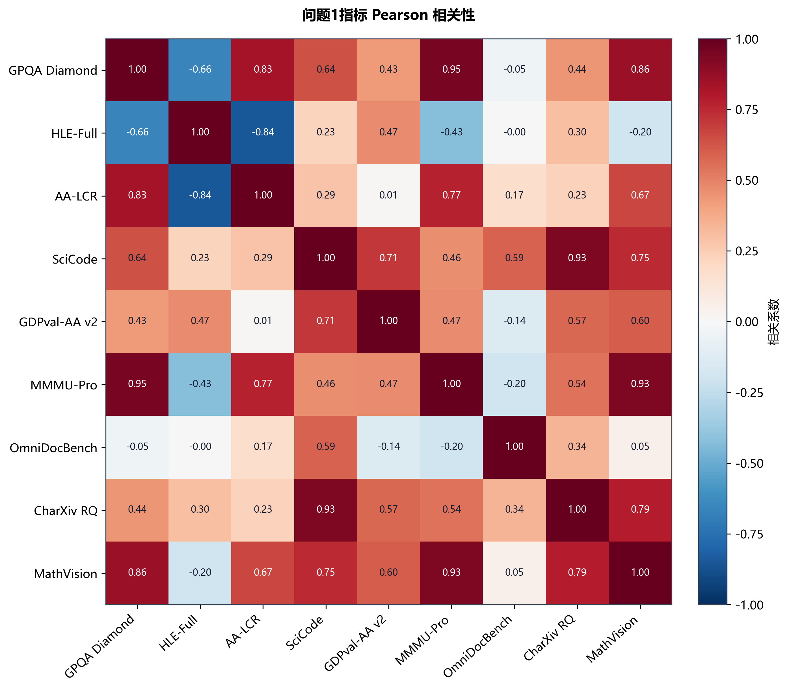
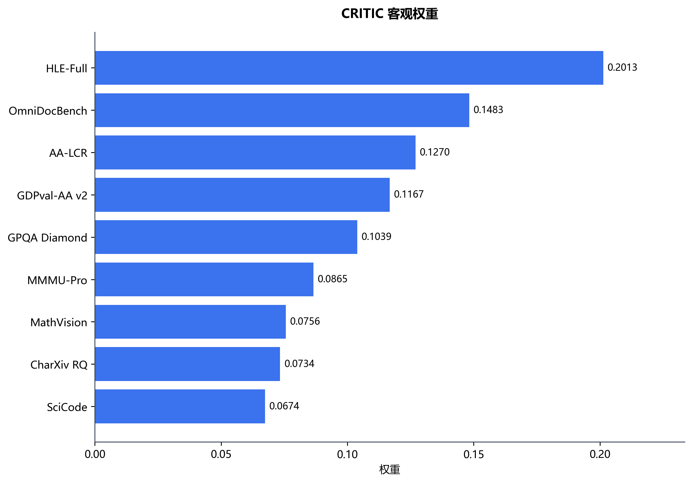
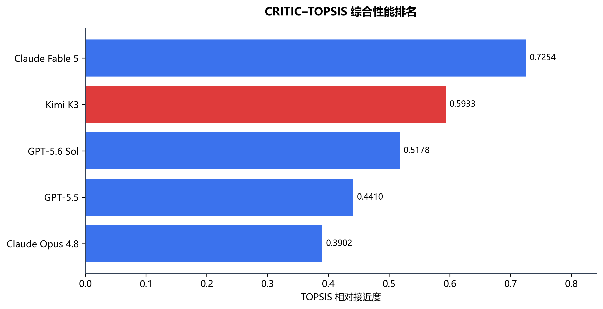
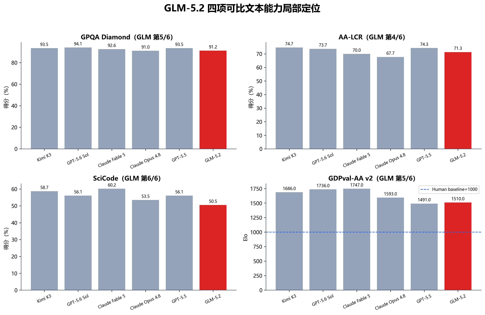
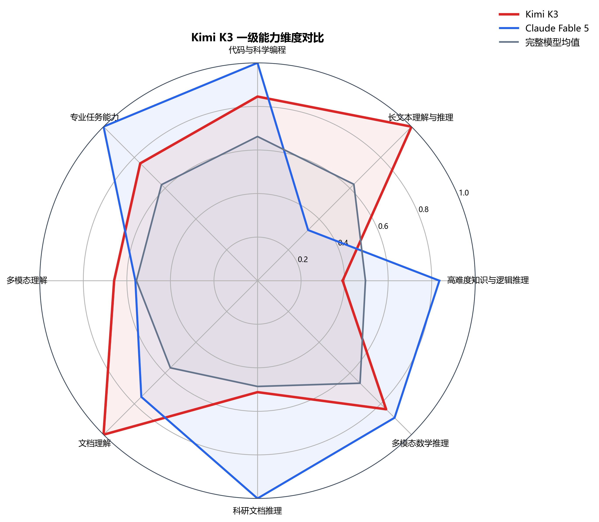
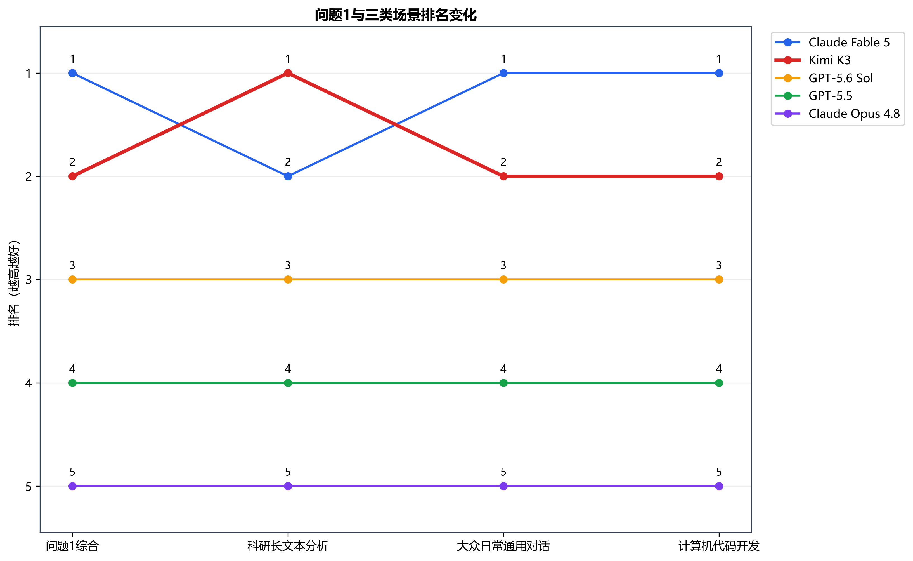
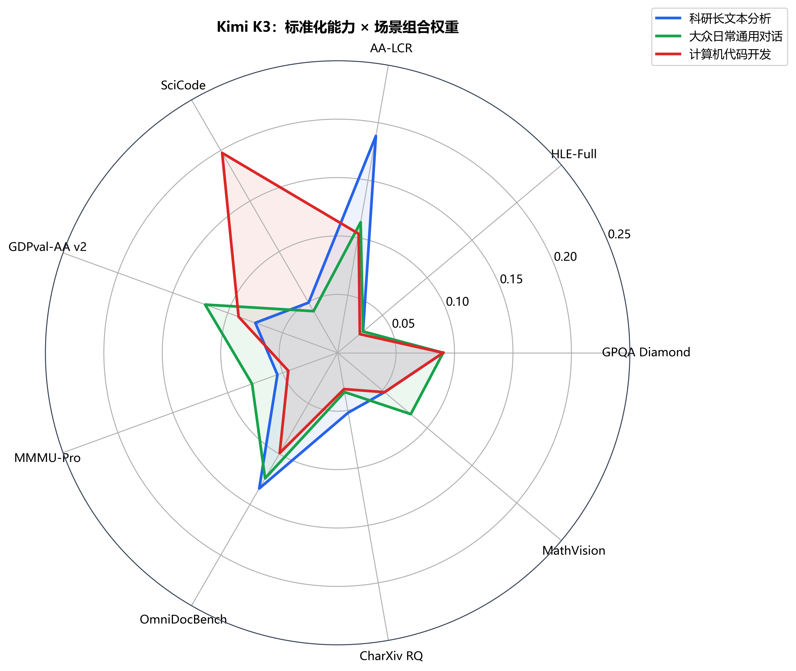
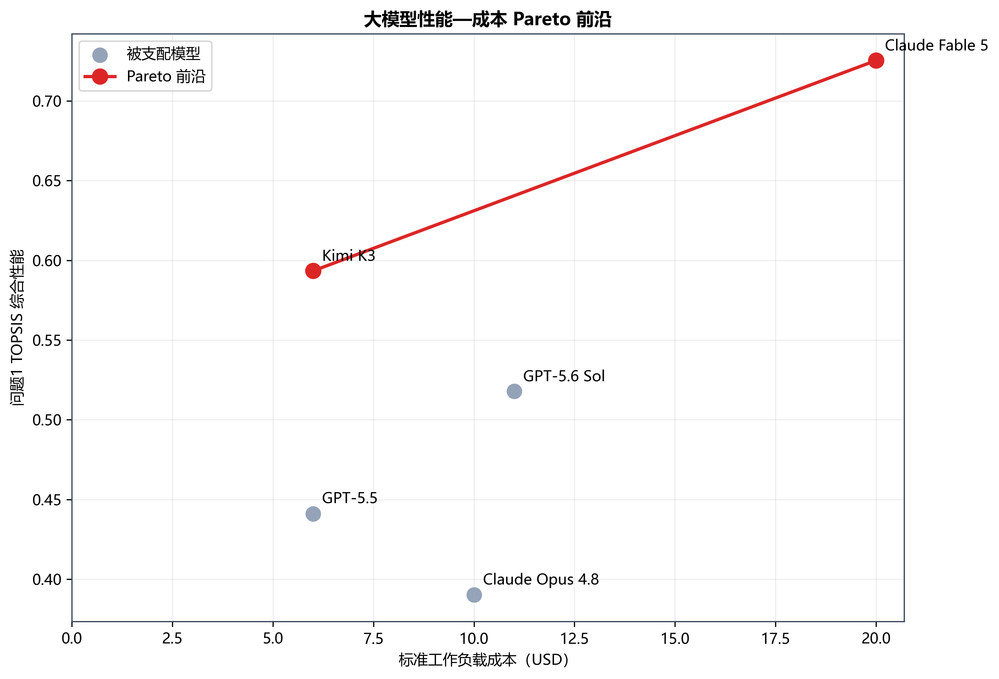
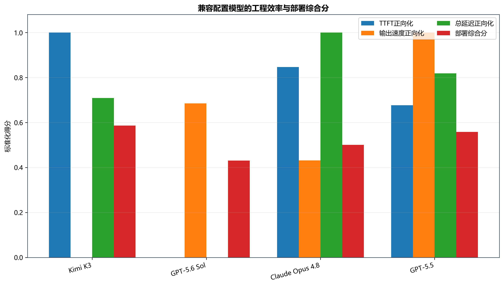

# 摘要

大语言模型在科研、办公与软件开发中的应用迅速扩展，但公开评测在版本、推理强度、工具使用和计费口径上存在明显差异，仅凭单一榜单难以形成可靠的综合判断。本文面向主流大语言模型综合性能评价问题，以 2026 年 8 月 17 日为统一数据截面，从 9 个候选模型中确定 Kimi K3、GPT-5.6 Sol、Claude Fable 5、Claude Opus 4.8、GPT-5.5 和 GLM-5.2 为研究池，在不自行调用模型、不插补缺失成绩的前提下，解决指标体系构建、场景化评价以及性能—成本选型三个问题。

针对问题一，先从公开报告、标准 Benchmark 和统一横评平台收集 17 项候选指标，经版本核验、覆盖率、区分度和语义复核后冻结 9 项核心指标；再通过 Pearson 与 Spearman 相关分析识别冗余风险，采用 CRITIC 法从对比强度和指标冲突性两方面确定客观权重，并用 TOPSIS 计算综合贴近度。结果显示，Claude Fable 5、Kimi K3、GPT-5.6 Sol 分列前 3，得分分别为 0.7254、0.5933 和 0.5178。Kimi K3 在 AA-LCR 与 OmniDocBench 上领先，在科研文档处理方面优势突出，而 HLE-Full 是其主要短板。GLM-5.2 仅有 4/9 项同口径数据，因此只进行局部位次分析，不给出虚构的总排名。针对问题二，将 CRITIC 权重与三类场景偏好各按 50% 组合后重新实施 TOPSIS。Kimi K3 在科研长文本场景以 0.6547 排名第 1，在日常对话和代码开发场景均排名第 2。针对问题三，构造“100 万输入 token+20 万输出 token”的标准负载，结合 Pareto 前沿、预算约束和兼容配置下的工程效率进行选型。Kimi K3 与 Claude Fable 5 构成性能—成本前沿；20 美元以下预算优先推荐 Kimi K3，预算达到 20 美元时推荐 Claude Fable 5。

为检验结论可靠性，本文使用熵权法复算，并对 9 项权重分别进行 ±10%、±20% 扰动。综合排名前三在 36 组扰动中保持不变，最小 Kendall 秩相关系数为 0.8；科研场景中 Kimi 保持第一的概率为 88.89%。研究建立了来源可追溯、缺失处理保守、场景和预算可解释的评价流程，可为组织在不同任务与预算下选择大语言模型提供量化依据。

**关键词：** 大语言模型；CRITIC；TOPSIS；组合赋权；Pareto 前沿；敏感性分析

# 1 问题重述

随着推理模型、长上下文模型和智能体系统的发展，大语言模型的公开成绩已覆盖科学推理、代码生成、文档理解、多模态推理与专业任务等多个方向。然而，不同榜单常采用不同版本、推理预算、工具链和评测时间，模型的高分并不必然意味着在实际场景中具有更好的稳定性或成本效益。因此，需要在统一且可核验的数据口径下构建多指标评价体系。

题目要求围绕 Kimi K3 等主流模型完成三项任务：第一，梳理潜在性能指标，分析指标间相关性，筛选关键指标，建立合理权重并给出综合得分和排名，同时分析 Kimi K3 的优势与不足；第二，面向科研长文本分析、大众日常对话和计算机代码开发三种场景，建立差异化评价模型并解释场景排名变化机制；第三，综合模型性能、使用成本、推理时延与计算消耗，揭示性能—落地成本关系，并在不同预算下给出选型建议。

本文坚持只使用官方技术报告、权威横评平台和标准 Benchmark 的公开数据，不自行调用模型测评。所有有效数字均保留来源、版本、测试设置和检索日期；无法确认同口径的数据记为缺失值，不将“未报告”解释为零。

# 2 问题分析

## 2.1 问题一分析

问题一的难点不在于简单汇总榜单，而在于解决指标异质性与数据可比性。首先要限定模型版本和时间截面，避免同名模型、预览版本与不同推理配置混用；其次应把百分制与 Elo 等不同量纲分别标准化；最后必须在指标区分度、相关性与任务语义之间平衡。基于此，本文采用“候选池筛选—相关性复核—CRITIC 客观赋权—TOPSIS 排序”的路线。对于覆盖不足的 GLM-5.2，采用局部同口径比较而非均值插补，以保证主排名的公平性。

## 2.2 问题二分析

同一模型在不同应用中的价值取决于任务偏好。科研长文本更重视长上下文推理、文档理解和科学知识；日常对话更强调一般任务完成、多模态理解和稳定推理；代码开发则更依赖科学编程与复杂指令执行。完全主观赋权容易放大偏见，完全客观赋权又无法反映应用偏好。因此，本文将问题一的 CRITIC 权重与预先声明的场景偏好等比例组合，再用同一 TOPSIS 框架计算场景得分，并通过权重扰动分析排名是否依赖某个主观设定。

## 2.3 问题三分析

成本比较必须先定义工作负载，否则输入/输出单价无法直接对应实际支出。本文统一采用 100 万输入 token 和 20 万输出 token，计算标准 API 成本，以综合性能为效益轴、成本为代价轴识别 Pareto 前沿，并对多个预算阈值求解可行集合中的最高性能模型。对于推理时延，只有配置兼容的数据才进行横向比较。公开资料不具备同硬件、同精度和同批量下的能耗测量，因此不使用参数量或延迟冒充电力消耗，而将能耗作为数据边界明确披露。

# 3 模型假设

1. 在同一来源、同一 Benchmark 版本及同一测试设置组成的 cohort 内，模型成绩可进行横向比较。
2. 公开成绩在数据截面 2026-08-17 有效；滚动更新的价格与效率记录不外推为模型的永久属性。
3. 冻结的 9 项能力指标均为效益型指标，数值越大表示相应能力越强；不同量纲只在逐指标标准化后进入综合评价。
4. 缺失值表示“未获得满足口径的公开数据”，不等于模型得分为零，也不采用均值、回归或主观估计填补。
5. 标准 API 单价能反映本文定义工作负载下的直接调用成本，但不包含缓存、批处理、区域加价、长上下文阶梯价格及组织内部运维费用。
6. 场景偏好权重是透明的研究设定，可用于比较场景变化，但不替代具体组织的专家调查结果。

# 4 符号说明

| 符号 | 含义 | 单位 |
|:---:|---|:---:|
| \(x_{ij}\) | 模型 \(i\) 在指标 \(j\) 上的原始成绩 | 原指标单位 |
| \(z_{ij}\) | 极差标准化后的指标值 | — |
| \(r_{jk}\) | 指标 \(j,k\) 的 Pearson 相关系数 | — |
| \(w_j\) | 指标 \(j\) 的 CRITIC 客观权重 | — |
| \(a_{sj}\) | 场景 \(s\) 对指标 \(j\) 的偏好权重 | — |
| \(w^*_{sj}\) | 场景组合权重 | — |
| \(D_i^+,D_i^-\) | 模型到正、负理想解的距离 | — |
| \(S_i\) | TOPSIS 综合贴近度 | — |
| \(C_i\) | 模型在标准负载下的 API 成本 | 美元 |
| \(E_i\) | 兼容配置下的工程效率得分 | — |

# 5 模型建立与求解

## 5.1 问题一：综合性能评价模型

### 5.1.1 数据预处理与指标体系

统一数据截面为 2026-08-17。原始 Benchmark 表含 148 条记录，模型元数据表含 9 条模型记录与 79 条逐字段证据，效率表含 9 条模型记录与 27 条逐指标证据。数据来源包括 Kimi、OpenAI、Anthropic、Z.ai 官方文档，Artificial Analysis 横向评测以及 Benchmark 官方榜单。每条记录保留 `model_id`、精确版本、测试设置、来源 URL 和检索日期。

初始候选池包含 17 项指标。先按覆盖率不低于 80%、有效样本标准差非零和口径可核验三项条件筛选，再依据任务语义形成 9 项核心指标：GPQA Diamond、HLE-Full、AA-LCR、SciCode、GDPval-AA v2、MMMU-Pro、OmniDocBench、CharXiv RQ 和 MathVision。它们分别覆盖高难科学推理、开放难题、长上下文推理、科学编程、专业任务、多模态理解和科研文档处理。

所有指标均为效益型，采用极差标准化：

\[
z_{ij}=\frac{x_{ij}-\min_i x_{ij}}{\max_i x_{ij}-\min_i x_{ij}}. \tag{1}
\]

标准化在每个指标内部独立完成，因此百分制与 Elo 不发生直接相加。若某指标只在 5 个模型中有同口径结果，则最大值和最小值只由这 5 个有效样本确定。

### 5.1.2 指标相关性分析

分别计算 Pearson 与 Spearman 相关系数。Pearson 描述线性关系，Spearman 用秩次降低异常尺度对判断的影响。Spearman 绝对值不低于 0.9 的组合有 GPQA Diamond—MMMU-Pro（0.9211）与 SciCode—CharXiv RQ（0.9747）。但共同样本仅 5 个，且两组指标分别代表文本科学推理与多模态推理、科学编程与文档图表理解，删除任一项都会损失场景语义。因此保留全部 9 项，并在敏感性分析中检验相关性可能导致的权重风险。

### 5.1.3 CRITIC 客观赋权

CRITIC 法同时考虑指标的对比强度与冲突性。令 \(\sigma_j\) 为标准化指标 \(j\) 的标准差，\(r_{jk}\) 为指标间 Pearson 相关系数，则指标信息量和权重为

\[
C_j=\sigma_j\sum_{k=1}^{n}(1-r_{jk}),\qquad
w_j=\frac{C_j}{\sum_{j=1}^{n}C_j}. \tag{2}
\]

HLE-Full、OmniDocBench 和 AA-LCR 的权重最高，分别为 0.2013、0.1483 和 0.1270；SciCode 权重最低，为 0.0674。权重反映的是当前样本中的区分度与互补性，不应解释为永久的重要性排序。

### 5.1.4 TOPSIS 综合评价

构造加权矩阵 \(v_{ij}=w_jz_{ij}\)，以每列最大值和最小值分别作为正、负理想解 \(V^+\)、\(V^-\)。模型与理想解的欧氏距离为

\[
D_i^+=\sqrt{\sum_j(v_{ij}-v_j^+)^2},\qquad
D_i^-=\sqrt{\sum_j(v_{ij}-v_j^-)^2}. \tag{3}
\]

定义综合贴近度

\[
S_i=\frac{D_i^-}{D_i^++D_i^-}. \tag{4}
\]

\(S_i\) 越大，表示模型越接近正理想解。只有 9 项成绩完整的 5 个模型进入主排名。

| 排名 | 模型 | TOPSIS 得分 |
|---:|---|---:|
| 1 | Claude Fable 5 | 0.7254 |
| 2 | Kimi K3 | 0.5933 |
| 3 | GPT-5.6 Sol | 0.5178 |
| 4 | GPT-5.5 | 0.4410 |
| 5 | Claude Opus 4.8 | 0.3902 |

GLM-5.2 在冻结 cohort 中只有 4 项可比较成绩：GPQA Diamond 91.2（第 5/6）、AA-LCR 71.3（第 4/6）、SciCode 50.5（第 6/6）、GDPval-AA v2 1510（第 5/6）。Z.ai 官方另报 HLE 40.5，但测试来源不同，只作为补充证据，不替换主矩阵的缺失值。

### 5.1.5 Kimi K3 优势与不足

Kimi K3 在 AA-LCR 和 OmniDocBench 中排名第一，在 SciCode、MMMU-Pro 与 CharXiv RQ 中排名第二，说明其优势集中于长文本推理、文档理解、科研材料处理及跨模态文档任务。其 HLE-Full 标准化得分为 0.1765，在 5 个完整样本中排名第 4，是最明显的短板；GPQA Diamond 与 GDPval-AA v2 处于中游。因此，Kimi 更适合需要长文档分析和结构化材料理解的科研工作流，而在极高难度开放推理任务上仍有提升空间。

## 5.2 问题二：三类场景评价模型

### 5.2.1 场景组合赋权

为避免完全主观赋权，本文保留 50% 的 CRITIC 客观信息，并加入 50% 场景偏好：

\[
w^*_{sj}=0.5w_j+0.5a_{sj},\qquad \sum_j a_{sj}=1. \tag{5}
\]

科研长文本场景提高 AA-LCR、CharXiv RQ 与 OmniDocBench 的优先级；日常对话提高 GDPval-AA v2 与多模态指标权重；代码开发将 SciCode 的主观权重设为 0.40。组合后，科研场景权重最高的三项为 AA-LCR 0.1885、HLE-Full 0.1607、OmniDocBench 0.1341；日常对话为 HLE-Full 0.1607、GDPval-AA v2 0.1584、OmniDocBench 0.1241；代码开发为 SciCode 0.2337、HLE-Full 0.1407、GDPval-AA v2 0.1184。

### 5.2.2 场景排序结果

将 \(w^*_{sj}\) 代入式（3）—（4）重新计算 TOPSIS，得到：

| 模型 | 科研长文本 | 日常对话 | 代码开发 |
|---|---:|---:|---:|
| Claude Fable 5 | 0.6471（2） | 0.7208（1） | 0.7722（1） |
| Kimi K3 | 0.6547（1） | 0.6343（2） | 0.6840（2） |
| GPT-5.6 Sol | 0.5703（3） | 0.6024（3） | 0.5838（3） |
| GPT-5.5 | 0.5276（4） | 0.4392（4） | 0.4896（4） |
| Claude Opus 4.8 | 0.3147（5） | 0.3431（5） | 0.3384（5） |

科研场景中，Kimi K3 从综合第 2 升至第 1，原因是其 AA-LCR 与 OmniDocBench 的领先表现得到更高权重；日常对话和代码开发中，Claude Fable 5 的多项均衡优势使其保持第一。GPT-5.6 Sol 在三个场景均为第三，说明其相对位置对偏好变化不敏感。

## 5.3 问题三：性能—成本与预算选型模型

### 5.3.1 标准工作负载成本

设输入和输出单价分别为 \(P_{in,i}\)、\(P_{out,i}\)，单位均为美元/百万 token。标准工作负载为 100 万输入 token 和 20 万输出 token，则

\[
C_i=P_{in,i}+0.2P_{out,i}. \tag{6}
\]

| 模型 | 标准成本/美元 | 综合得分 | 性能/美元 | Pareto 前沿 |
|---|---:|---:|---:|:---:|
| Kimi K3 | 6 | 0.5933 | 0.0989 | 是 |
| GPT-5.5 | 6 | 0.4410 | 0.0735 | 否 |
| Claude Opus 4.8 | 10 | 0.3902 | 0.0390 | 否 |
| GPT-5.6 Sol | 11 | 0.5178 | 0.0471 | 否 |
| Claude Fable 5 | 20 | 0.7254 | 0.0363 | 是 |

### 5.3.2 Pareto 前沿与预算决策

若模型 \(p\) 满足 \(C_p\le C_q\)、\(S_p\ge S_q\)，且至少一个不等式严格成立，则称 \(p\) 支配 \(q\)。不被任何模型支配的集合构成 Pareto 前沿。计算结果表明 Kimi K3 与 Claude Fable 5 位于前沿：前者代表较低成本下的高性价比，后者代表较高预算下的最高综合性能。

在给定预算 \(B\) 下，选择规则为

\[
i^*(B)=\arg\max_{i:C_i\le B}S_i. \tag{7}
\]

预算为 6、10、12、16 美元时均推荐 Kimi K3；预算达到 20 美元时推荐 Claude Fable 5。GLM-5.2 的标准成本为 1.918 美元，但缺少完整性能得分，不能进入该规则。

### 5.3.3 工程效率与能耗边界

对配置兼容的 4 个模型，将 TTFT 和总延迟作为成本型指标正向化，将输出速度作为效益型指标正向化，再等权平均得到工程效率 \(E_i\)。部署综合分定义为

\[
Deploy_i=0.7S_i+0.3E_i. \tag{8}
\]

Kimi K3、GPT-5.5、Claude Opus 4.8、GPT-5.6 Sol 的部署分依次为 0.5862、0.5582、0.5010、0.4309。该结果只适用于统一平台和兼容配置，不能与含 fallback 或第三方部署的数据混用。

计算消耗方面，当前公开数据不含同硬件、同 batch、同量化精度和同输出长度下的平均功率、J/token 或 kWh/任务。参数总量不能替代推理激活参数，延迟与吞吐也不能替代功率，因此本文不估算能耗排名。若后续获得统一测量，应把 GPU 型号和数量、精度、batch、输入输出长度、平均功率与总时间共同记录，再将能耗折算为环境或电力成本。

# 6 模型检验

## 6.1 替代赋权检验

采用熵权法替代 CRITIC 后重新运行 TOPSIS，5 个完整模型的名次与原结果完全一致，表明主排序不是 CRITIC 特定公式造成的偶然结果。熵权与 CRITIC 在个别指标上的数值不同，但都赋予高区分度指标较高信息量。

## 6.2 权重敏感性分析

分别把 9 个 CRITIC 权重乘以 0.8、0.9、1.1、1.2，并在每次扰动后重新归一化，共形成 36 组情形。Claude Fable 5、Kimi K3、GPT-5.6 Sol 始终保持第 1、2、3；GPT-5.5 与 Claude Opus 4.8 仅出现一次相邻换位，扰动排名相对基准的最小 Kendall \(\tau=0.8\)。场景模型中，Kimi 在科研长文本场景的名次范围为 1—2，保持第 1 的概率为 88.89%；在日常对话与代码开发中始终为第 2。

## 6.3 成本规律检验

对 5 个完整模型拟合探索性关系

\[
S=0.1994+0.1481\ln(C). \tag{9}
\]

得到 \(R^2=0.3147\)、调整 \(R^2=0.0862\)、RMSE=0.0978。斜率为正说明样本中价格与性能存在弱正相关，但价格只能解释约 31.5% 的性能波动；由于样本量仅为 5，该回归只用于描述，不能用于因果推断或预测新模型。

# 7 模型评价与改进

## 7.1 模型优点

1. **数据可追溯。** 每个有效数字均关联精确版本、测试设置、来源 URL 和检索日期，能够复核数据截面。
2. **缺失处理保守。** 不把未报告成绩当作零，不对 GLM-5.2 强行插补或给出失真的总排名。
3. **评价结构完整。** 从通用性能扩展到场景偏好、API 成本、工程效率和预算约束，形成从“能力”到“落地”的闭环。
4. **结论具有可解释性。** CRITIC 权重可分解为对比强度与冲突性，场景排名变化可由指标权重与模型长板共同解释。
5. **稳健性检验充分。** 替代赋权和 36 组扰动均支持主要排序，避免只报告单次模型结果。

## 7.2 模型不足

1. 研究池只有 6 个模型，主排名完整样本只有 5 个，相关系数和回归不宜外推。
2. 核心能力表来自统一报告中的横向数据，虽设置一致，仍可能存在厂商选择性披露。
3. 场景偏好是透明但主观的设定，尚未通过大规模专家问卷校准。
4. 价格模型没有纳入缓存命中、batch、区域加价、长上下文阶梯和企业折扣。
5. 缺少同硬件条件下的计算能耗，当前只能评价 API 成本与时间效率，不能评价真实电力消耗。

## 7.3 改进方向

后续可建立滚动数据管道，对模型版本和价格变动进行时间戳管理；采用 Delphi 法或层次分析法汇总领域专家的场景偏好，并与 CRITIC 权重进行多层组合；在可获得原始回答时，使用 Bootstrap 对 TOPSIS 得分给出置信区间；在统一 GPU、精度和 batch 下测量 J/token，使能耗与 API 成本共同进入全生命周期成本函数；最后可把单模型选择扩展为路由优化，在预算、时延与质量约束下为不同请求动态分配模型。

# 8 AI 工具使用声明

本研究使用 OpenAI Codex 辅助完成公开资料整理、程序代码检查、论文结构整理和语言润色。所有用于计算的数据均来自公开可核验来源，模型未自行生成或猜测缺失成绩；指标选择、数学方法、参数设定、结果解释与最终论文内容由参赛团队复核。详细使用过程和可复现脚本保存在项目支撑材料中。

# 参考文献

[1] Diakoulaki D, Mavrotas G, Papayannakis L. Determining objective weights in multiple criteria problems: The CRITIC method[J]. Computers & Operations Research, 1995, 22(7): 763-770.

[2] Hwang C L, Yoon K. Multiple Attribute Decision Making: Methods and Applications[M]. Berlin: Springer-Verlag, 1981.

[3] Shannon C E. A mathematical theory of communication[J]. Bell System Technical Journal, 1948, 27(3): 379-423.

[4] Moonshot AI. Kimi K3 technical report[EB/OL]. 2026-08-17, https://www.kimi.com/blog/kimi-k3.

[5] Artificial Analysis. AI model analysis and comparison[EB/OL]. 2026-08-17, https://artificialanalysis.ai/.

[6] OpenAI. API models and pricing documentation[EB/OL]. 2026-08-17, https://platform.openai.com/docs/pricing/.

[7] Anthropic. Claude models and pricing documentation[EB/OL]. 2026-08-17, https://platform.claude.com/docs/en/about-claude/pricing.

[8] Z.ai. GLM-5.2 model documentation[EB/OL]. 2026-08-17, https://docs.bigmodel.cn/cn/guide/models/text/glm-5.2.

[9] OpenAI Codex, GPT-5 系列, OpenAI, 2026-08-18.

# 附录

## 附录 1 支撑材料文件说明

| 路径 | 内容 |
|---|---|
| `data/sources/` | Benchmark、模型元数据、价格与效率的逐字段来源索引 |
| `data/processed/` | 冻结后的能力矩阵和清洗结果 |
| `results/q1/` | 指标筛选、相关性、CRITIC 权重、TOPSIS 与 Kimi 分析 |
| `results/q2/` | 三类场景权重、排序、排名变化和敏感性结果 |
| `results/q3/` | 成本审计、Pareto、预算推荐、工程效率与回归结果 |
| `results/phase4b/` | GLM-5.2 四项局部比较及独立 HLE 说明 |

## 附录 2 程序说明

核心程序使用 Python 编写。`scripts/run_pipeline.py` 重建 Phase 2—7 的基础流程；`scripts/run_q1.py`、`run_q2.py`、`run_q3.py` 分别生成三问的论文结果；`scripts/run_glm_supplement.py` 生成 GLM-5.2 局部对照；`scripts/validate_q1.py`、`validate_q2_q3.py` 和单元测试用于检查权重和、缺失值、排名、Pareto 前沿与文件完整性。代码不调用任何大语言模型进行自测，也不填补公开数据中的缺失项。
