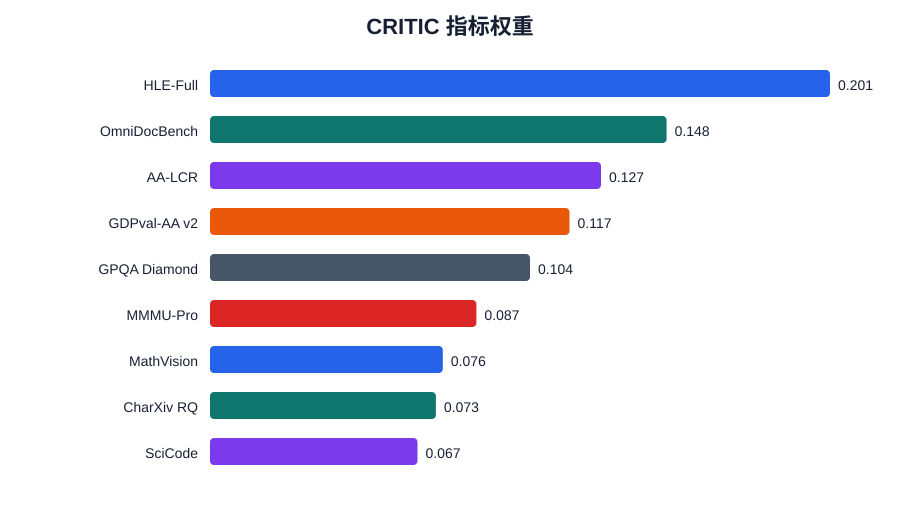
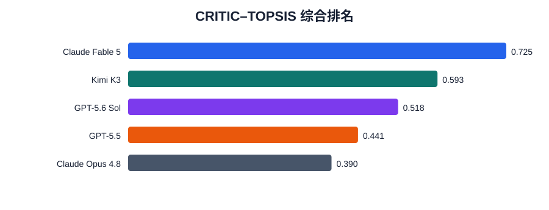
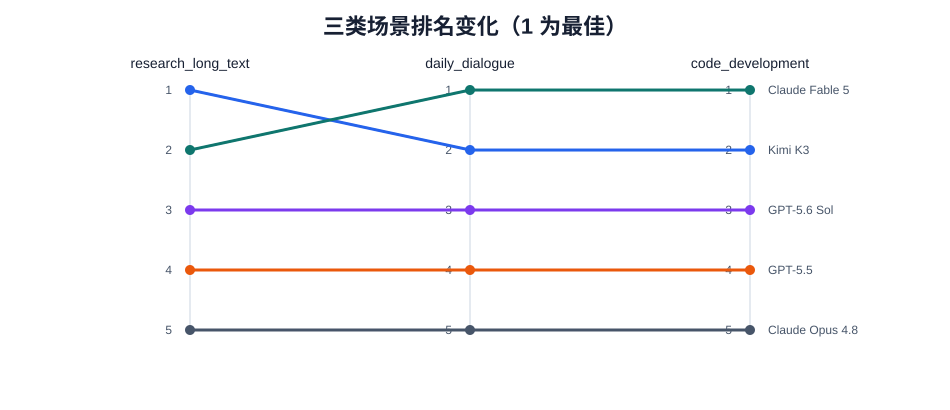
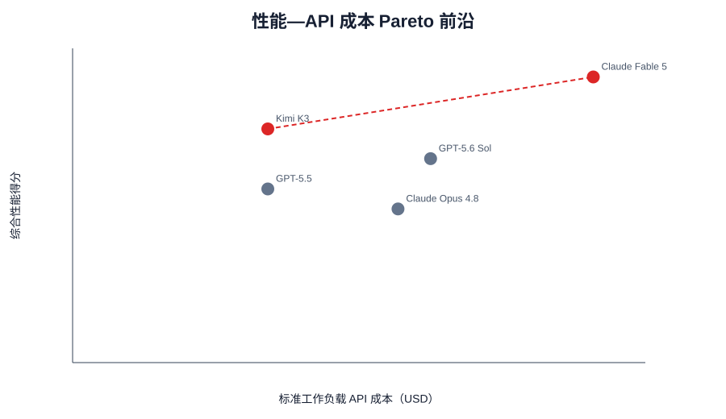

# 主流大语言模型综合性能评价与选型研究

## 摘要

本文面向公开资料条件下的大语言模型综合评价问题，建立“数据冻结—可比性清洗—指标筛选—客观赋权—场景评价—成本效益—稳健性检验”的完整流程。研究以 2026-08-17 为统一数据截面，从 9 个候选模型中选取 Kimi K3、GPT-5.6 Sol、Claude Fable 5、Claude Opus 4.8、GPT-5.5 和 GLM-5.2，并从高难推理、长文本、代码、专业任务、多模态及文档理解等维度冻结 9 个核心指标。所有数值均来自公开可追溯资料，不自行调用模型测试，不插补缺失成绩。

相关性分析表明，GPQA Diamond 与 MMMU-Pro、SciCode 与 CharXiv RQ 分别呈现较高秩相关，但共同样本仅 5 个且语义维度不同，故不机械删除。本文采用 CRITIC 确定客观权重，并以 TOPSIS 评价完整数据模型。Claude Fable 5、Kimi K3、GPT-5.6 Sol 分列综合排名前三；GLM-5.2 因仅有 4/9 项成绩而不参与主排名。场景组合赋权显示 Kimi K3 在科研长文本场景排名第一，在日常对话和代码开发场景排名第二。以 100 万输入 token 与 20 万输出 token 为标准工作负载时，Kimi K3 与 Claude Fable 5 构成性能—成本 Pareto 前沿。熵权法及 36 组权重扰动保持前三名顺序不变，说明主要结论在给定数据范围内较稳健。

关键词：大语言模型；CRITIC；TOPSIS；场景评价；Pareto 前沿；敏感性分析

## 1 问题重述与研究框架

研究回答三个问题：其一，如何从公开且设置兼容的 Benchmark 中构建指标体系、确定权重并比较主流模型；其二，模型价值如何随科研长文本、日常对话和代码开发场景变化；其三，如何结合 API 成本和推理效率形成预算约束下的选型策略。

技术路线为：公开数据审计 → 固定可比 cohort → 缺失与单位检查 → 相关性和覆盖率筛选 → CRITIC 客观赋权 → TOPSIS 综合排序 → 场景偏好组合赋权 → 成本效益与 Pareto 分析 → 熵权法及权重扰动检验。

## 2 数据、假设与符号

### 2.1 数据边界

统一截面为 2026-08-17。Benchmark 原始表含 145 条记录，元数据表含 9 条模型记录及 79 条逐字段证据，效率表含 9 条模型记录及 27 条逐指标证据。来源包括同一平台横向评测、Benchmark 榜单及厂商官方报告；版本、工具使用、reasoning 配置、agent scaffold 或快照不同的数据不混入同一比较队列。

最终模型池共 6 个。Gemini 3.1 Pro Preview 因 preview 状态及严格可比覆盖不足被排除；DeepSeek V4 Pro 0813 与 Qwen3.8 2.4T A95B 距截止日仅 4 天和 5 天，分项数据不足，故保留原始记录但不进入正式模型池。

### 2.2 基本假设

1. 固定来源 cohort 内的成绩具有横向可比性，但不同厂商的最高 reasoning effort 不代表完全相同的计算预算。
2. 公布成绩在数据截面处有效；滚动效率指标只代表检索时段，不视为永久属性。
3. 9 个能力指标均为效益型指标，数值越大表示能力越强。
4. 缺失值不等于零。GLM-5.2 的 5 个缺失核心成绩不插补，因而不进入要求完整矩阵的 TOPSIS 主排名。

设模型为 (i=1,\ldots,m)，指标为 (j=1,\ldots,n)，原始成绩为 (x_{ij})，标准化值为 (z_{ij})，权重为 (w_j)。

## 3 数据清洗与指标筛选

所有核心记录固定 benchmark version、test setting、source name，并生成 6×9 宽表和 54 行长表。百分数和 Elo 不直接求和，而是在建模阶段分别进行极差标准化：

\[
z_{ij}=\frac{x_{ij}-\min_i x_{ij}}{\max_i x_{ij}-\min_i x_{ij}}.
\]

9 个指标覆盖率均为 83.3% 或 100%，标准差均非零。Spearman 绝对值不低于 0.9 的组合有两对：GPQA Diamond—MMMU-Pro（0.9211）和 SciCode—CharXiv RQ（0.9747）。由于共同观测仅 5 个，且两对指标分别代表文本科学推理与多模态推理、科学编程与研究文档理解，删除任一项都会损失场景语义。因此 Phase 3 保留全部 9 项，并把相关性作为后续稳健性风险而非自动删除规则。

## 4 CRITIC–TOPSIS 综合评价

### 4.1 CRITIC 权重

CRITIC 同时利用指标对比强度和冲突性。令标准化指标 (j) 的标准差为 \(\sigma_j\)，指标间 Pearson 相关系数为 \(r_{jk}\)，则：

\[
C_j=\sigma_j\sum_{k=1}^{n}(1-r_{jk}),\qquad
w_j=\frac{C_j}{\sum_j C_j}.
\]

权重最高的三个指标为 HLE-Full（0.2013）、OmniDocBench（0.1483）和 AA-LCR（0.1270）；最低为 SciCode（0.0674）。权重反映当前样本中的差异性与冲突性，不等价于永久的重要性判断。



### 4.2 TOPSIS

构造加权矩阵 (v_{ij}=w_jz_{ij})，正、负理想解分别为各列最大值和最小值。模型到理想解的欧氏距离为 (D_i^+)、(D_i^-)，贴近度为：

\[
S_i=\frac{D_i^-}{D_i^++D_i^-}.
\]

主排名只使用 9 项成绩完整的 5 个模型：

| 排名 | 模型 | TOPSIS 得分 |
|---:|---|---:|
| 1 | Claude Fable 5 | 0.7254 |
| 2 | Kimi K3 | 0.5933 |
| 3 | GPT-5.6 Sol | 0.5178 |
| 4 | GPT-5.5 | 0.4410 |
| 5 | Claude Opus 4.8 | 0.3902 |

GLM-5.2 只有 4/9 项可用成绩（44.4%），标记为“数据不足、暂不排名”。这比将缺失值置零或均值填补更符合题目数据约束。



### 4.3 Kimi K3 优势与短板

Kimi K3 在 AA-LCR 和 OmniDocBench 排名第一，在 SciCode、MMMU-Pro、CharXiv RQ 排名第二，说明其长文本推理、文档理解和科研材料处理具有竞争力。其 HLE-Full 标准化得分仅 0.1765，在 5 个可比模型中位列第 4，是最明确的短板；GPQA Diamond 和 GDPval-AA v2 位列中游。综合得分第 2，表明 Kimi 的优势集中于长文本与文档场景，而极高难度开放推理仍有改进空间。

## 5 三类场景评价

为体现应用偏好，本文为每个场景声明一组总和为 1 的主观优先权重 (a_{sj})，再与 CRITIC 权重线性组合：

\[
w_{sj}^{*}=0.5w_j+0.5a_{sj}.
\]

科研长文本场景提高 AA-LCR、CharXiv RQ 和 OmniDocBench 权重；日常对话提高 GDPval-AA v2 与多模态指标权重；代码开发将 SciCode 的主观权重设为 0.40。组合权重保留一半客观信息，减少完全依赖主观赋权的风险。

| 场景 | 第 1 | 第 2 | 第 3 |
|---|---|---|---|
| 科研长文本 | Kimi K3 | Claude Fable 5 | GPT-5.6 Sol |
| 日常通用对话 | Claude Fable 5 | Kimi K3 | GPT-5.6 Sol |
| 代码开发 | Claude Fable 5 | Kimi K3 | GPT-5.6 Sol |

Kimi 在科研长文本场景由综合第 2 升至第 1，直接源于其 AA-LCR、OmniDocBench 的领先表现；在日常与代码场景仍为第 2。其余完整数据模型的名次基本稳定，说明当前模型差异不仅由场景权重造成，也由多项能力的整体差距造成。



## 6 性能—成本与工程效率

定义标准工作负载为 100 万输入 token 与 20 万输出 token，使用标准 API 单价：

\[
Cost_i=P_{in,i}+0.2P_{out,i}.
\]

完整排名模型中，Kimi K3 成本为 6 美元、综合得分为 0.5933；Claude Fable 5 成本为 16 美元、得分为 0.7254。两者构成 Pareto 前沿。GPT-5.5 与 Kimi 同为 6 美元但性能更低；GPT-5.6 Sol 和 Claude Opus 4.8 也被更低成本且更高得分的模型支配。

预算为 6、10、12 美元时，规则“预算内综合得分最高”均推荐 Kimi K3；预算达到 16 美元时推荐 Claude Fable 5。GLM-5.2 的标准成本最低，但因能力覆盖不足不能进入该推荐规则，不能把“未评价”误写成“低性能”。



效率分析只比较配置兼容的 Kimi K3、GPT-5.6 Sol、Claude Opus 4.8 和 GPT-5.5。对 TTFT、输出速度、总延迟分别做正向化后等权平均，再以 70% 性能和 30% 工程效率形成部署分数。该子分析中 Kimi 部署分数为 0.5862，优于其余三个兼容模型；Claude Fable 5 的 fallback 和 GLM-5.2 的第三方部署不兼容，因此不计算部署分数。

## 7 稳健性与规律分析

熵权法得到的完整模型排名与 CRITIC 完全一致。进一步将每个 CRITIC 权重分别乘以 0.8、0.9、1.1、1.2 后重新归一化，共形成 36 个扰动场景。Claude Fable 5、Kimi K3、GPT-5.6 Sol 在所有场景中稳定保持第 1、第 2、第 3；GPT-5.5 与 Claude Opus 4.8 仅出现一次相邻换位。各扰动排名相对基准的 Kendall \(\tau\) 最低为 0.8。

对 5 个完整模型拟合探索性关系

\[
Performance=0.2054+0.1484\ln(Cost),
\]

得到 (R^2=0.2242)。样本量仅为 5，说明当前数据只能支持“价格与性能存在弱正相关、但价格解释力有限”的描述，不能进行因果推断。

## 8 模型评价与局限

本方法的优点是来源可追溯、比较队列固定、缺失处理保守、权重与排序均可复现，并通过场景、成本及稳健性形成闭环。主要局限如下：

1. 最终样本仅 6 个模型，主排名完整样本为 5 个，相关系数和回归结果不宜外推。
2. 核心比较 cohort 来自官方技术报告中的统一表格，虽设置一致，但仍可能存在厂商报告偏差。
3. GLM-5.2 的核心能力覆盖不足；当前不能给出公平总排名。
4. Claude Fable 5 的效率记录包含 Opus fallback，GLM-5.2 为第三方部署，因此工程效率子分析只有 4 个模型。
5. 价格没有纳入区域加价、缓存命中、batch、长上下文阶梯或峰谷套餐；预算结论仅对应本文声明的标准工作负载。
6. 场景主观权重是透明的研究设定，仍应在专家问卷或团队评审后更新。

## 9 结论

在不插补缺失数据的前提下，Claude Fable 5 获得通用综合评价第一，Kimi K3 第二。Kimi 的核心竞争力是长文本、文档理解和科研材料处理，其主要短板是 HLE-Full 所代表的极高难度开放推理。科研长文本场景下 Kimi 升至第一；在当前标准 API 工作负载下，Kimi 与 Claude Fable 5 构成 Pareto 前沿，并在中低预算区间表现出更好的性能成本平衡。主排名在熵权法和权重扰动下稳定，但所有结论必须限定在数据截面、固定 cohort 和完整样本范围内。

## 10 复现说明

在仓库根目录运行：

```bash
python scripts/run_pipeline.py
python -m unittest discover -s tests -v
```

原始来源索引位于 `data/sources/`；清洗口径见 `notes/phase2_processing.md`；所有中间结果分别位于 `results/phase3/` 至 `results/phase7/`。脚本只使用 Python 标准库。
